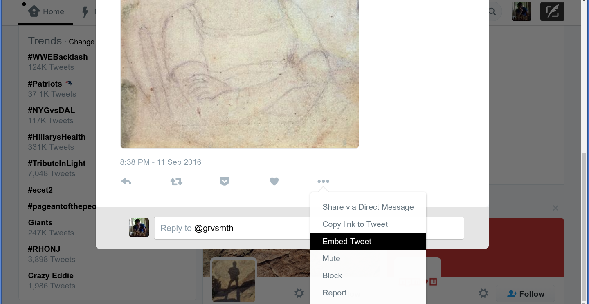

# Embed a Tweet in your Post

###  Why Embed a Tweet?

When you embed a tweet, you allow your readers to use Twitter functionality such as reply, follow, and retweet without leaving your post. Embedded tweets also have a professional look and sidestep some attribution issues.

### How to Embed a Tweet

1. Find the tweet you want to embed in your post.
2. In the bottom right corner of the tweet, click the `...` (ellipsis or three dots) button.
3. From the dropdown menu, select `Embed tweet`.

  

  

4. Copy the HTML code from the box (it should already be selected for you).
5. In the draft of your blog post, change to HTML mode by clicking the `Text` tab at the top right of the edit panel.
6. Find where you want to add the embedded tweet and paste in the HTML you copied from Twitter.
7. Preview the page to see your tweet embedded within the post. You may want to add `
` and/or `
` tags around the HTML you pasted to put some space between the tweet and the rest of the content.
