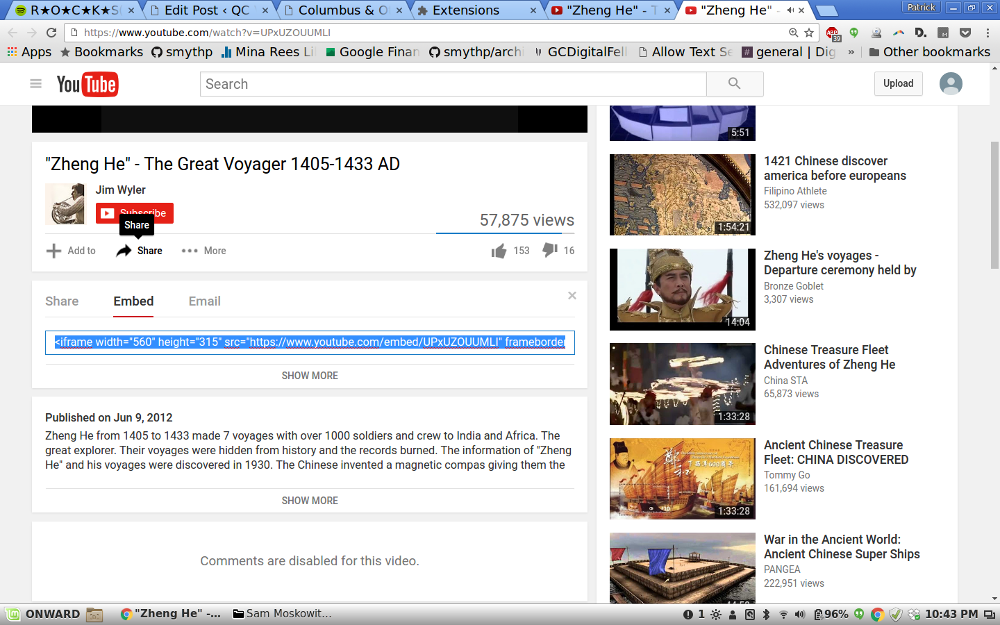

# Embeding YouTube videos

Video is rapidly becoming one of the most popular forms of media on the web, and it's especially suited to mobile readers. The below will show you how to embed YouTube videos in your blog posts.

1\. Find the video you would like to link to.
2\. Click the "share" button, which is below the section listing the video name and the number of views.



<ol start="3">
<li>Click the Embed button that appears.</li>
<li>Copy the text in the box, which should already be selected. It will look something like this:</li>
</ol>

```
<iframe width="560" height="315" src="https://www.youtube.com/embed/UPxUZOUUMLI" frameborder="0" allowfullscreen></iframe>
```

<ol start="5">
<li>In your blog editing page, click the button that says "Text" that is above and to the right of the main editing area.</li>
<li>Once you're in text mode, find where in the post you want to embed the video and paste in the HTML from YouTube that you copied in step 4.</li>
<li>Save the draft and preview. You should see the video embedded in your blog post.</li>
</ol>

When you're done, your video should look like this:

<center>
<iframe width="560" height="315" src="https://www.youtube.com/embed/UPxUZOUUMLI" frameborder="0" allowfullscreen></iframe>
</center>

### Troubleshooting

If you're seeing the HTML instead of the video when you preview, you might not have been in text mode. Erase the HTML and try again, making sure you switch from Visual mode to HTML mode.

Make sure you've copied all of the HTML code, including the opening `<` and closing `>` characters.
