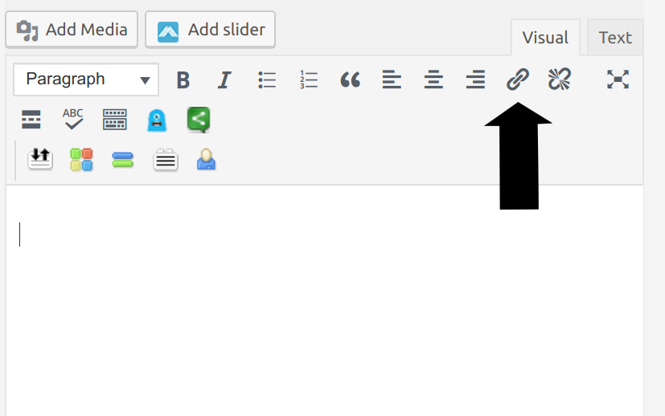

# Links and Linking

## What is a hyperlink?

Hyperlinks are the backbone of the modern web. They're snippets of text that can be clicked on to bring the user to another page or resource. You likely click hundreds of links every day, but might not have thought much about their use or how they are created.

A hyperlink has two parts. The **anchor text** is the text that you see. By default, it's text that's colored blue, but that can be changed by the creator of the website. The other component is the **URL**. That's the address the user will be sent to when the link is clicked.

Take this link, for example:

[Google](http://www.google.com)  

Clicking this link will take you to the Google home page. The anchor text for this link is "Google." The URL looks like this: http://www.google.com

## How to Create a Link

In WordPress, links can be created in three ways: using the link button on the edit panel, using the link keyboard shortcut, and creating a link in HTML.

### Link Button

The link button looks like a small chain and is situated above the main edit area when writing your blog post:

To use it, select the text you wish to make into anchor text. With your text selected, click the link button (the small chain). In the box that appears, paste the URL you wish your anchor text to link to.

### Shortcut

Instead of pressing the link button, you can use a keyboard shortcut. Select the text you wish to use as anchor text and then press `Control-k` on your keyboard. Enter the URL in the box that appears.

### HTML

If you prefer, you can create or edit the link using HTML. To edit HTML directly, click the "Text" tab above the main edit area while writing your blog post, the one next to the "Visual" tab. The main edit area will change to a HTML view.

Links look like this in HTML:

	<a href="http://www.google.com">Google</a>
	
or like this:

	<a href="http://qcvoices.qwriting.qc.cuny.edu/">Check out the QC Voices website!</a>

