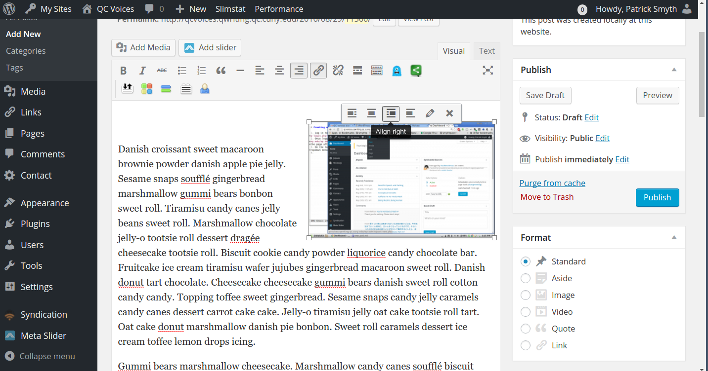

# Best Practices for Adding Images

### How many images?

A good rule of thumb is to have one image for every 250-300 words. Many blog posts are around 500 words—if your post is around this length, aim to add two or three images. If you have two (or an even number) of images in your post, you may want to align them all on the right. If you have three (or an odd number), you may want to alternate between right- and left-aligned images. 

### Image rights and attribution

Make sure you have the rights to use the image:
* On [Flickr](https://www.flickr.com/), after doing a search, click the dropdown that says "Any license." Select either Creative Commons or Commercial Use Allowed, either with or without modifications.
* On [Google Images](https://images.google.com/), after doing a search, click Search Tools > Usage rights. Select Labeled for reuse or labeled for noncommercial use, either with or without modifications. 
* Of course, you also have the right to post any image you create yourself.

You need to credit the source of the image in the image caption—this is called "providing attribution." You can find good examples of attribution [here](https://wiki.creativecommons.org/wiki/Best_practices_for_attribution), but the caption should at least credit the author of the image and provide the license if possible.

### Step-by-step: adding images 

1. While [adding a new post](new_post.md), move the text insert prompt to the beginning of a paragraph and click the Add Media button above the writing area. (It's just below the "Permalink" section.)
2. In the `Insert Media` menu that appears, pick the Upload files tab. CLick `Select Files` or drag your picture into the large box.
3. Your uploaded image should now be selected in the Insert Media page. Click the blue Insert Into Posts box at the bottom right.
4. Click on the image in the post writing view and select Align Left or Align Right from the menu that pops up. 
  

  
5. Check how your image looks by clicking the Preview button under Publish on the right-hand menu. If you don't like the position of the image, you can undo adding the image with Ctrl-Z, put your text insert cursor in a new place, and run through the adding image process again.

